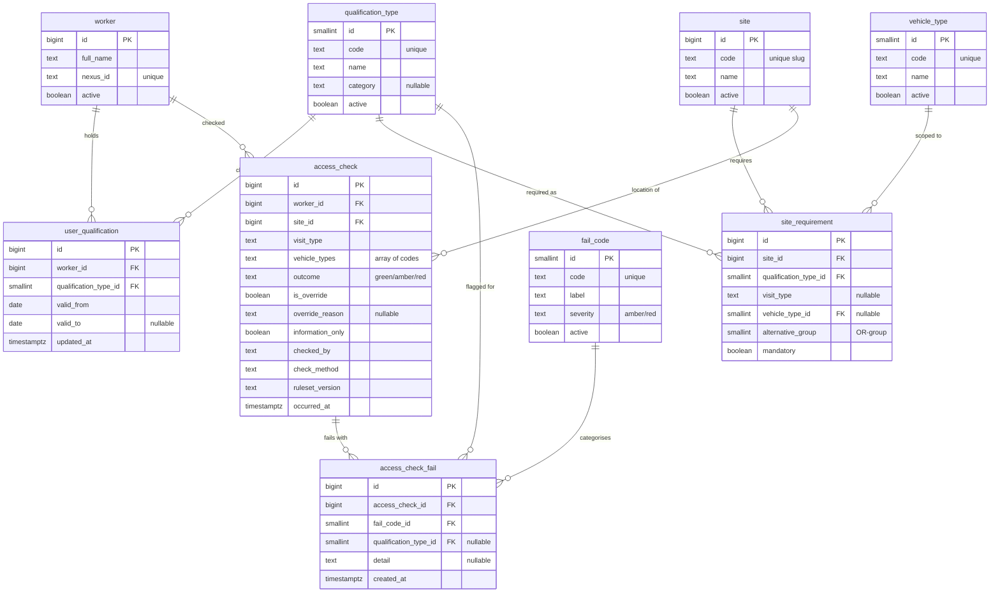

# MP Connect — compliance schema

Data model for the site access check function (demo). Nine tables: three
lookups, two core entities, and the fact/log tables. Compliance is evaluated
at check time and every check is logged with a RAG outcome; failures are
recorded against a controlled list of fail codes.

## Tables

**Lookups**
- `qualification_type` — controlled list of qualification codes (CSCS, WAH, MED…). The shared vocabulary both fact tables reference.
- `vehicle_type` — controlled list of vehicle types (tanker, tipper, mixer, van) for driver-scoped requirements.
- `fail_code` — controlled list of failure reasons with a severity (`amber` warning / `red` fail).

**Core**
- `worker` — the person being checked.
- `site` — the site being controlled.

**Compliance (current state)**
- `user_qualification` — the qualifications a worker holds, with a validity window.
- `site_requirement` — what a site requires, scoped by `visit_type` / `vehicle_type`; `alternative_group` expresses OR-logic (any one in a group satisfies it); `mandatory` distinguishes red vs advisory.

**Access (logs)**
- `access_check` — one row per gate check: overall RAG `outcome`, override flag, who/how it was checked, and the `ruleset_version` in force.
- `access_check_fail` — child rows of a check: one per failing/warning requirement, each carrying a `fail_code`.

## Notes
- RAG: `red` = missing/expired mandatory qualification; `amber` = a required qualification expiring within the grace window (default 30 days); `green` = all satisfied.
- Current-state model — qualifications and requirements are edited in place; the check/fail logs are the historical record.
